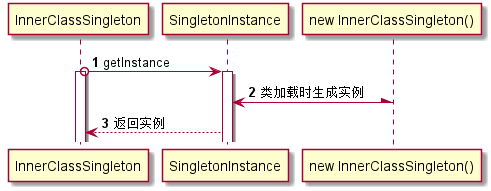

#单例模式作业 
##单例创建方式 
1.饿汉式单例 
优点：代码简单。 
缺点：即使不调用也会创建。 
2.双重检查式单例 
优点：懒汉式加载。 
缺点：为了避免了线程不安全，使用了线程锁降低程序效率。 
3.内部类式单例 
优点：线程安全，延迟加载，效率高。 
4.枚举式单例 
优点：利用了java语言特性，底层使用静态块实现，线程安全可防止被破坏。 
缺点：实现类为枚举类型，代码结构不够优雅。加载方式实际为饿汉式。 
5.容器式单例 
优点：由容器来控制实例的创建，避免了自己创建的各种问题。 
缺点：代码复杂。一般由大型框架集成，如Spring。 
 
##单例破坏方式 
1.反射破坏 
解决办法：通过在构造方法中判断来避免重复创建。 
2.序列化破坏 
解决办法:通过重写在反序列化时调用的readResolve方法来避免。 

##内部类时序图 

